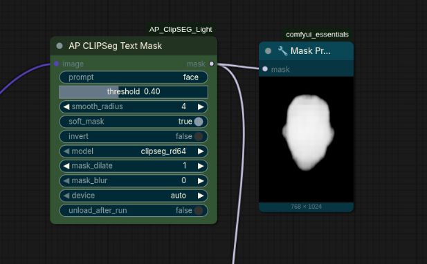
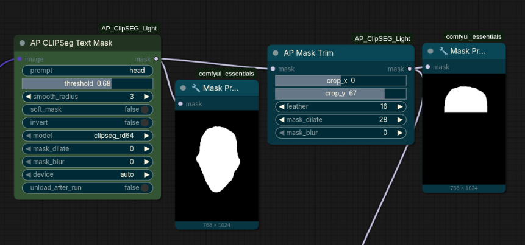

# AP ClipSEG Light

A lightweight ComfyUI custom node pack that generates segmentation masks from plain-text prompts using [CLIPSeg](https://huggingface.co/docs/transformers/model_doc/clipseg).

## Features

- **Text-driven masking** — describe what you want masked in plain language (e.g. `face`, `sky`, `person`)
- **Multi-prompt averaging** — separate prompts with `|` to blend multiple heatmaps: `face | head | eyes`
- **Soft or hard masks** — output a feathered sigmoid heatmap or a crisp binary mask
- **numpy 2.x safe** — all image I/O goes through torch/PIL, no numpy array ops
- **Auto model caching** — models are kept in GPU/CPU memory after the first load; no reload cost on subsequent runs
- **numpy 2 / TF crash fix** — automatically stubs broken TensorFlow imports caused by transformers ≥ 4.50 on numpy 2.x systems
- **Mask Trim utility** — trim any mask by percentage along X/Y axes with feathered edges

## Requirements

| Package | Minimum version |
|---|---|
| `torch` | any recent |
| `torchvision` | ≥ 0.15 |
| `transformers` | any recent |
| `Pillow` | any recent |

Models are downloaded automatically from the HuggingFace Hub on first use:

| Model | Size | Quality |
|---|---|---|
| `clipseg_rd64` (default) | ~350 MB | Higher |
| `clipseg_rd16` | ~100 MB | Faster |

## Installation

```bash
# Option A – ComfyUI Manager (search "AP ClipSEG Light")
# Option B – manual
git clone https://github.com/adampolczynski/ComfyUI_AP_ClipSEG_Light \
  ComfyUI/custom_nodes/AP_ClipSEG_Light
pip install transformers Pillow
```

## Node: AP CLIPSeg Text Mask



| Input | Type | Description |
|---|---|---|
| `image` | IMAGE | Input image batch |
| `prompt` | STRING | Text description of the region to mask. Use `\|` to separate multiple prompts |
| `threshold` | FLOAT (0.01–0.99) | Heatmap threshold. Lower → larger mask, higher → tighter mask |
| `smooth_radius` | INT (0–32) | Gaussian blur radius applied before thresholding |
| `soft_mask` | BOOLEAN | `True` = feathered sigmoid output, `False` = binary mask |
| `invert` | BOOLEAN | Invert the output mask |
| `model` | ENUM | `clipseg_rd64` or `clipseg_rd16` |
| `device` | ENUM | `auto` / `cuda` / `cpu` |
| `unload_after_run` | BOOLEAN | Free model VRAM after each run |

**Output:** `MASK` — float32 tensor `[B, H, W]` in `[0, 1]`

## Node: AP Mask Trim



Trims a mask by percentage along the X and/or Y axis. The output canvas size is unchanged — trimmed pixels fade to black.

| Input | Type | Description |
|---|---|---|
| `mask` | MASK | Input mask |
| `crop_x` | INT (-100–100) | Trim from right (positive) or left (negative). Example: `30` removes rightmost 30 % |
| `crop_y` | INT (-100–100) | Trim from bottom (positive) or top (negative). Example: `-40` removes top 40 % |
| `auto_align` | BOOLEAN | When `True`, trim axes rotate to match the mask's principal orientation (PCA). crop_y trims the mask's own "bottom" regardless of rotation |
| `feather` | INT (0–200) | Soft-edge width in pixels at the cut boundary |
| `mask_dilate` | INT (0–64) | Expand the trimmed mask outward by this many pixels |
| `mask_blur` | INT (0–64) | Gaussian blur applied to the final mask |

**Output:** `MASK` — trimmed float32 tensor, same dimensions as input

**Tip:** chain `AP CLIPSeg Text Mask (prompt=hair)` → `AP Mask Trim (crop_y=-50, feather=20)` to isolate the top of the head.

## License

MIT — see [LICENSE](LICENSE).
